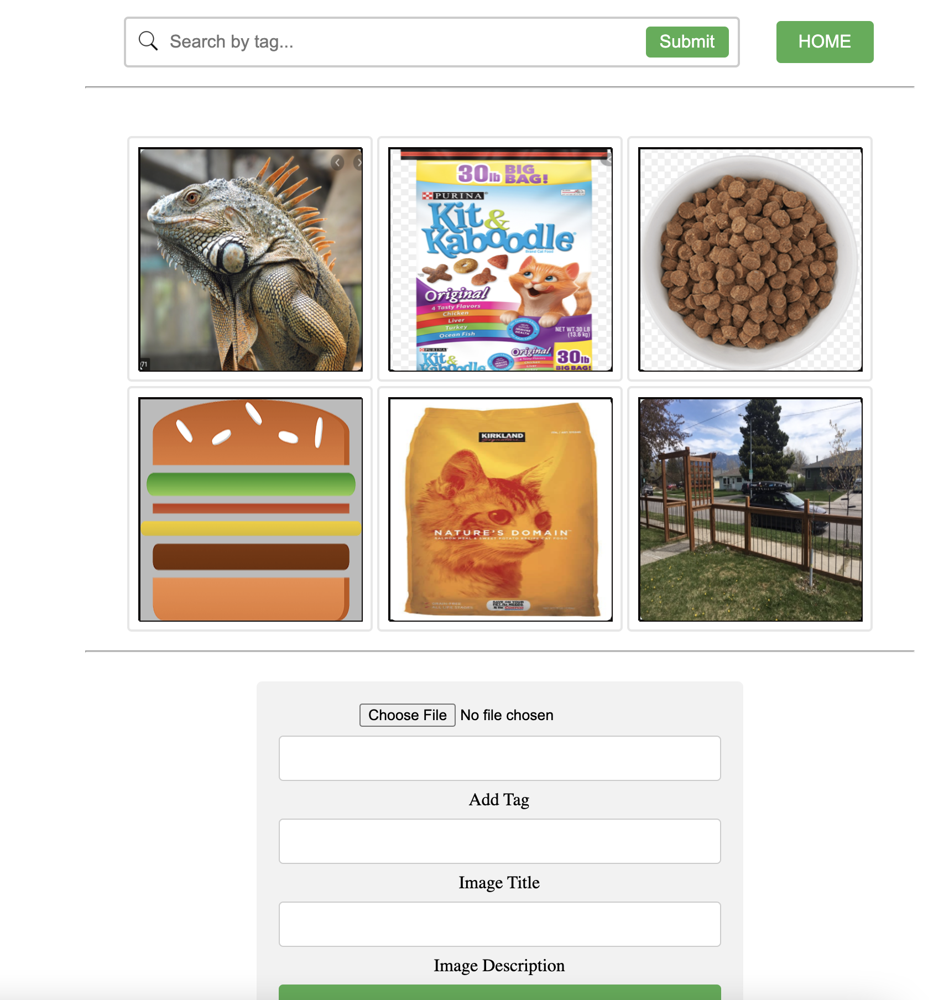

#### Photo Sharing Toy Project ####

## Objective ##
Build a simple photo sharing webapp to demonstrate use to DB, Remote Storage, UI Framework

## Components ##
1. Sql DB
2. MinIO
3. API

## Usage ##
# Run Locally #
This project is built on docker containers and is intended to be ran locally through docker-compose.

NOTE: To allow minio signed urls to resolve to the containerized service, add `minio` to your hosts file:
```
127.0.0.1       minio
```

Run the application:
From the root directory run
 
```
docker-compose up --build
```

## Interaction ##

The wepapp can be viewed at `http://localhost`

On start up some random photos are uploaded into storage and the DB. The homepage should look similar to: 

To test the search/filter try typing `dog food` into the filter bar.

When a new photo is uploaded, the returned results should include both the uploaded photo and any other realated (tagged) photos.

## TODOs ##
1. Upgrade UI
2. Handle View All
3. Delete an image/image(s)
6. User Input Validation
7. resize /format - standardize uploaded photos

